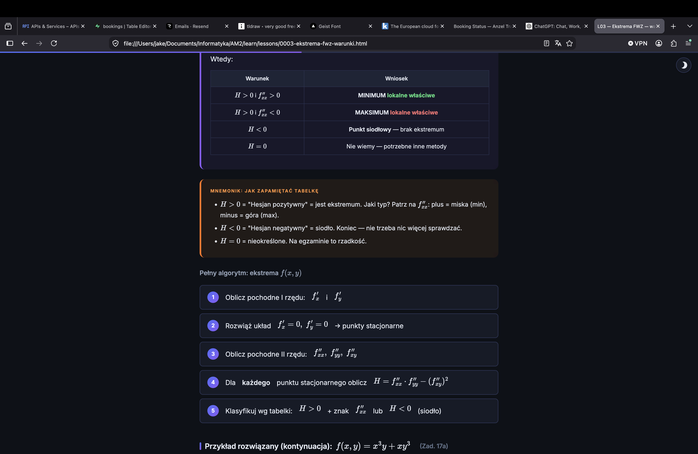

# AM2 — Analiza Matematyczna 2

Platforma do nauki na egzamin AM2 (teoria + praktyka). Zakres materiału oparty na poprzednich egzaminach oraz na wykładach i listach zadań od prowadzącego.
Wygenerowane w Claude Code z użyciem `/teach` skill od mattpocock.



## Jak uruchomić

1. Pobierz folder lub sklonuj repo

```bash
git clone https://github.com/jake-hh/learn-PK-AM2
```

2. Otwórz plik lekcji w przeglądarce (`lessons/0001-badanie-funkcji-1-zmiennej.html`)

Na Maku działa Firefox — Safari blokuje skrypty przy otwieraniu plików lokalnie.

## Lekcje (`lessons/`)

| # | Temat | Typ |
|---|-------|-----|
| [L01](lessons/0001-badanie-funkcji-1-zmiennej.html) | Badanie funkcji f: ℝ→ℝ | Praktyka |
| [L02](lessons/0002-pochodne-czastkowe-gradient-jakobian.html) | Pochodne cząstkowe, gradient, Jakobian | Teoria |
| [L03](lessons/0003-ekstrema-fwz-warunki.html) | Ekstrema FWZ — warunki | Teoria |
| [L04](lessons/0004-ekstrema-fwz-zadania.html) | Ekstrema FWZ — zadania | Praktyka |
| [L05](lessons/0005-calki-podwojne-fubini.html) | Całki podwójne — Fubini | Teoria |
| [L06](lessons/0006-calki-podwojne-biegunowe.html) | Całki podwójne — współrzędne biegunowe | Teoria+Praktyka |
| [L07](lessons/0007-calki-podwojne-zadania.html) | Całki podwójne — zadania | Praktyka |
| [L08](lessons/0008-quiz-powtorkowy-teoria-cz1.html) | Quiz powtórkowy: teoria cz. 1 | Quiz |
| [L09](lessons/0009-rr1-typy-rozpoznawanie.html) | RR I rzędu — typy i rozpoznawanie | Teoria |
| [L10](lessons/0010-rr1-czynnik-calkujacy.html) | RR I rzędu — czynnik całkujący | Praktyka |
| [L11](lessons/0011-rr1-zagadnienia-poczatkowe.html) | RR I rzędu — zagadnienia początkowe | Praktyka |
| [L12](lessons/0012-rr2-jednorodne.html) | RR II rzędu jednorodne — równanie charakterystyczne | Teoria+Praktyka |
| [L13](lessons/0013-rr2-niejednorodne-mwn.html) | RR II rzędu niejednorodne — metoda przewidywanych szczególnych | Praktyka |
| [L14](lessons/0014-rr2-zadania-zbiorcze.html) | RR II rzędu — zadania zbiorcze | Praktyka |
| [L15](lessons/0015-calki-krzywoliniowe-nieskierowane.html) | Całki krzywoliniowe nieskierowane | Teoria+Praktyka |
| [L16](lessons/0016-calki-krzywoliniowe-skierowane.html) | Całki krzywoliniowe skierowane | Teoria+Praktyka |
| [L17](lessons/0017-green-pole-potencjalne.html) | Twierdzenie Greena + pole potencjalne | Teoria+Praktyka |
| [L18](lessons/0018-calki-krzywoliniowe-zadania.html) | Całki krzywoliniowe — zadania zbiorcze | Praktyka |
| [L19](lessons/0019-potencjal-wyznaczanie.html) | Pole potencjalne i potencjał — wyznaczanie | Teoria+Praktyka |
| [L20](lessons/0020-calki-potrojne.html) | Całki potrójne — przegląd metod | Praktyka |
| [L21](lessons/0021-mega-quiz.html) | MEGA-QUIZ: wszystkie definicje i twierdzenia | Quiz |
| [L22](lessons/0022-symulacja-egzaminu.html) | Symulacja egzaminu praktycznego | Egzamin |
| [L23](lessons/0023-egzaminy-praktyka-rozwiazania.html) | Rozwiązania egzaminów praktycznych 2025+2026 | Egzamin |
